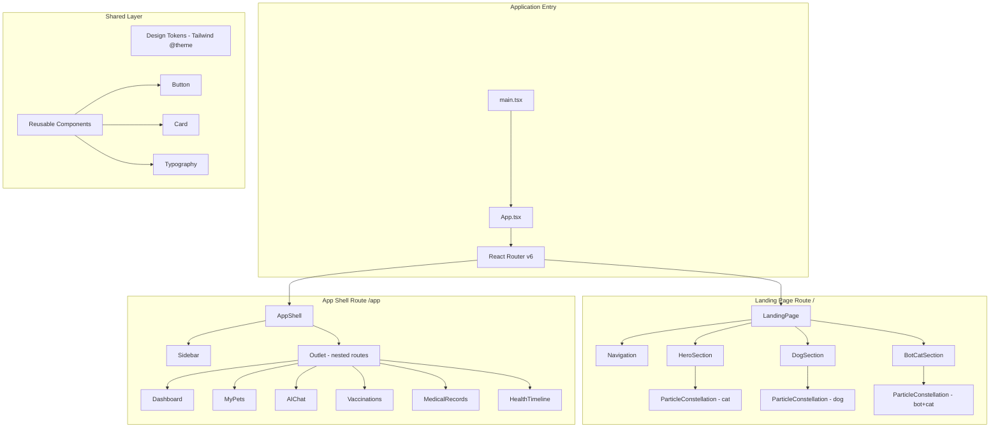

# Design Document: PawPal AI Landing Page

## Overview

PawPal AI Landing Page is a visually striking, dark cosmic marketing page and application shell built for hackathon demonstration. The implementation uses a particle constellation system rendered on HTML5 Canvas to create animated pet silhouettes (cat, dog, AI bot) that serve as the primary visual hook. The application is split into two major areas: a public scroll-based landing page with three full-bleed sections, and an authenticated app shell with sidebar navigation and placeholder route pages.

The architecture prioritizes visual impact and performance. Canvas-based particle rendering handles thousands of animated shapes without frame drops, Framer Motion orchestrates scroll-triggered entrances and floating animations, and Tailwind CSS v4 with a custom `@theme` block enforces the Dala Design System tokens consistently across all components.

**Key Design Decisions:**
- HTML5 Canvas over SVG for particles — SVG chokes on thousands of DOM nodes; Canvas draws them in a single compositing pass
- Silhouette masks defined as coordinate arrays — particles spawn within bounding polygons, creating organic pet shapes without raster images
- Single `@theme` block in Tailwind v4 — all design tokens live in one place, enforcing the "no shadows, no gradients, no elevation" constraint at the utility level
- Framer Motion `useInView` for scroll triggers — lightweight intersection observer pattern avoids scroll-listener jank

## Architecture



### Project Directory Structure

```
/client/src
├── main.tsx                    # Vite entry, mounts <App />
├── App.tsx                     # Router configuration
├── index.css                   # Tailwind directives + @theme block
├── components/
│   ├── ui/                     # shadcn/ui components (Button, Card)
│   ├── ParticleConstellation.tsx
│   ├── Navigation.tsx
│   ├── HeroSection.tsx
│   ├── DogSection.tsx
│   ├── BotCatSection.tsx
│   ├── AppShell.tsx
│   └── Sidebar.tsx
├── pages/
│   ├── LandingPage.tsx
│   ├── Dashboard.tsx
│   ├── MyPets.tsx
│   ├── AIChat.tsx
│   ├── Vaccinations.tsx
│   ├── MedicalRecords.tsx
│   └── HealthTimeline.tsx
├── lib/
│   ├── particles.ts            # Particle system engine (spawn, update, draw)
│   ├── silhouettes.ts          # Silhouette mask coordinate data
│   └── utils.ts                # cn() utility from shadcn
├── styles/
│   └── fonts.css               # Google Fonts import (Inter, Space Grotesk)
└── assets/
    └── logo.svg                # PawPal AI logo
```

## Components and Interfaces

### ParticleConstellation

The core visual engine. Renders thousands of geometric shapes on a Canvas element, constrained within silhouette mask boundaries.

```typescript
interface Particle {
  x: number;           // Current x position (canvas coords)
  y: number;           // Current y position (canvas coords)
  baseX: number;       // Anchor x (within silhouette mask)
  baseY: number;       // Anchor y (within silhouette mask)
  size: number;        // Radius 2-6px
  shape: 'triangle' | 'circle' | 'diamond';
  color: string;       // Hex from palette
  vx: number;          // Velocity x (drift)
  vy: number;          // Velocity y (drift)
  opacity: number;     // 0.3-1.0 for depth layering
  phase: number;       // Animation phase offset (0-2π)
}

interface SilhouetteMask {
  name: 'cat' | 'dog' | 'bot-cat';
  points: [number, number][];   // Normalized polygon vertices (0-1 range)
  width: number;                 // Reference width for aspect ratio
  height: number;                // Reference height for aspect ratio
}

interface ParticleConstellationProps {
  silhouette: SilhouetteMask;
  particleCount?: number;        // Default: 800-1500 depending on viewport
  className?: string;
  animate?: boolean;             // Default: true
}
```

**Rendering Pipeline:**
1. On mount, compute canvas dimensions from parent container
2. Scale silhouette mask to canvas size
3. Spawn particles at random positions within the mask polygon (point-in-polygon test)
4. Start `requestAnimationFrame` loop:
   - Clear canvas
   - For each particle: update position (sinusoidal drift around baseX/baseY), draw shape
   - Repeat at 60fps

**Entrance Animation:**
- Uses Framer Motion `useInView` hook on wrapper div
- When in view: particles fade in from opacity 0 → target opacity over 800ms
- Particles start scattered and converge toward silhouette positions over 1200ms (lerp toward baseX/baseY)

**Performance Safeguards:**
- Cap particle count at 2000 maximum
- Skip rendering when canvas is not in viewport (`IntersectionObserver`)
- Use `devicePixelRatio` for crisp rendering on retina displays
- Batch draw calls by shape type to minimize context state changes

```typescript
// Component signature
export function ParticleConstellation({
  silhouette,
  particleCount = 1200,
  className,
  animate = true,
}: ParticleConstellationProps): JSX.Element;
```

### Navigation

Fixed top navigation bar for the landing page.

```typescript
interface NavigationProps {
  className?: string;
}

// Internal structure
// <nav> fixed top-0 w-full z-50
//   <div> max-w-[1200px] mx-auto flex items-center justify-between px-6 h-16
//     <Logo /> — left aligned
//     <NavLinks /> — center-right: FEATURES, ABOUT, CONTACT
//     <Button variant="primary"> GET STARTED </Button> — far right
```

**Behavior:**
- Always `position: fixed` at top of viewport
- Background: `bg-black` with bottom border `border-b border-white/10`
- Nav links: uppercase, font-weight 600, font-size 13px, letter-spacing 0.05em, color `text-[#9a9a9a]`
- Nav link hover: transition to `text-white` over 200ms
- CTA button: Plum Voltage fill (`bg-[#8052ff]`), white text, rounded-3xl (24px), px-6 py-2

### HeroSection

First landing page section — cat constellation + headline + CTA.

```typescript
interface HeroSectionProps {
  className?: string;
}

// Layout: min-h-screen, grid grid-cols-2 (stacks on mobile)
// Left column: eyebrow + headline + body + CTA
// Right column: ParticleConstellation (cat silhouette)
```

**Typography Specs:**
- Eyebrow: 13px, weight 500, uppercase, tracking +0.05em, color `#bdbdbd`
- Headline: 78px (desktop) / 48px (mobile), weight 200, tracking -0.04em, color `#ffffff`, font Space Grotesk
- Body: 16px, weight 400, tracking +0.025em, color `#bdbdbd`, max-width 480px, line-height 1.6
- CTA: Button component with `variant="primary"`

### DogSection

Second section — dog constellation + AI symptom messaging.

```typescript
interface DogSectionProps {
  className?: string;
}

// Layout: centered, max-w-[1200px], py-[60px]
// ParticleConstellation (dog) above or beside text
// Headline + body text centered
```

**Specs:**
- Section gap: 60px top/bottom padding
- Headline: same display typography as Hero (weight 200, tracking -0.04em)
- Body: same body typography
- Dog constellation: centered, max-width 600px, aspect-ratio maintained

### BotCatSection

Third section — AI bot + cat constellation + auth CTA.

```typescript
interface BotCatSectionProps {
  className?: string;
}

// Layout: centered, max-w-[1200px], py-[60px]
// ParticleConstellation (bot-cat composite) + headline + login/signup CTA
```

**Specs:**
- Combined silhouette: AI bot shape alongside cat shape (two polygons rendered on one canvas)
- CTA area: Two buttons — "LOG IN" (outline style, Amber Spark border) + "SIGN UP" (primary, Plum Voltage fill)
- Both buttons link to `/app/dashboard` (placeholder navigation)

### AppShell

Authenticated layout wrapper with sidebar navigation.

```typescript
interface AppShellProps {
  children?: React.ReactNode;  // via <Outlet />
}

// Layout: flex min-h-screen
// <Sidebar /> — fixed left, w-[220px]
// <main> — flex-1, ml-[220px], p-8
//   <Outlet /> — React Router nested route content
```

### Sidebar

App shell left sidebar navigation.

```typescript
interface SidebarProps {
  className?: string;
}

interface NavItem {
  label: string;
  path: string;
  icon: React.ReactNode;  // Lucide icon
}

const NAV_ITEMS: NavItem[] = [
  { label: 'Dashboard', path: '/app/dashboard', icon: <LayoutDashboard /> },
  { label: 'My Pets', path: '/app/pets', icon: <PawPrint /> },
  { label: 'AI Chat', path: '/app/chat', icon: <MessageCircle /> },
  { label: 'Vaccinations', path: '/app/vaccinations', icon: <Syringe /> },
  { label: 'Medical Records', path: '/app/records', icon: <FileText /> },
  { label: 'Health Timeline', path: '/app/timeline', icon: <Clock /> },
];
```

**Behavior:**
- Background: `bg-black`, right border `border-r border-white/10`
- Logo at top with 24px padding
- Nav items: 14px, weight 500, color `#9a9a9a`, rounded-3xl padding
- Active item: `bg-[#8052ff]/10`, `text-[#8052ff]` — uses `useLocation()` to match current path
- Hover: `text-white` transition 200ms

### Placeholder Pages

All six placeholder pages follow the same pattern:

```typescript
interface PlaceholderPageProps {
  title: string;
  description: string;
}

export function PlaceholderPage({ title, description }: PlaceholderPageProps): JSX.Element;

// Each page is a thin wrapper:
// export function Dashboard() {
//   return <PlaceholderPage title="Dashboard" description="..." />;
// }
```

**Layout:**
- Title: display headline, weight 200, 48px, tracking -0.04em, color `#ffffff`
- Description: body text, 16px, weight 400, color `#bdbdbd`
- Optional decorative Card with dashed border (`border-dashed border-white/20`) containing "Coming Soon" message

### Reusable Components

**Button:**
```typescript
interface ButtonProps extends React.ButtonHTMLAttributes<HTMLButtonElement> {
  variant: 'primary' | 'outline' | 'ghost';
  size?: 'sm' | 'md' | 'lg';
  children: React.ReactNode;
}

// primary: bg-[#8052ff] text-white rounded-3xl
// outline: border-2 border-[#ffb829] text-[#ffb829] rounded-3xl bg-transparent
// ghost: text-[#9a9a9a] hover:text-white bg-transparent
```

**Card:**
```typescript
interface CardProps {
  children: React.ReactNode;
  className?: string;
}

// Base: bg-transparent border border-white/10 rounded-3xl p-6
// No shadow, no gradient, no elevation
```

**Typography:**
```typescript
interface TypographyProps {
  variant: 'display' | 'headline' | 'body' | 'eyebrow' | 'caption';
  children: React.ReactNode;
  className?: string;
  as?: keyof JSX.IntrinsicElements;
}

// display: font-space-grotesk text-[78px] font-extralight tracking-[-0.04em] text-white
// headline: font-space-grotesk text-[48px] font-extralight tracking-[-0.04em] text-white
// body: font-inter text-base font-normal tracking-[0.025em] text-[#bdbdbd] leading-relaxed
// eyebrow: font-inter text-[13px] font-medium uppercase tracking-[0.05em] text-[#bdbdbd]
// caption: font-inter text-sm font-normal text-[#9a9a9a]
```

## Data Models

### Silhouette Coordinate Data

Silhouette masks are defined as normalized polygon outlines (values 0-1, scaled at render time).

```typescript
// lib/silhouettes.ts

export const CAT_SILHOUETTE: SilhouetteMask = {
  name: 'cat',
  points: [
    // Simplified cat outline — ears, head, body, tail
    // ~40-60 vertices defining the boundary polygon
    [0.35, 0.0], [0.30, 0.15], [0.25, 0.05], // left ear
    [0.20, 0.20], [0.18, 0.35], [0.22, 0.45], // head left
    [0.40, 0.50], [0.60, 0.50],               // chin
    [0.78, 0.45], [0.82, 0.35], [0.80, 0.20], // head right
    [0.75, 0.05], [0.70, 0.15], [0.65, 0.0],  // right ear
    // ... body and tail vertices
    [0.25, 0.55], [0.20, 0.95], [0.35, 0.95], // body left + legs
    [0.65, 0.95], [0.80, 0.95], [0.75, 0.55], // body right + legs
    [0.85, 0.70], [0.95, 0.60],               // tail
  ],
  width: 500,
  height: 600,
};

export const DOG_SILHOUETTE: SilhouetteMask = {
  name: 'dog',
  points: [
    // Dog outline — floppy ears, snout, body, tail
    // ~50-70 vertices
  ],
  width: 600,
  height: 550,
};

export const BOT_CAT_SILHOUETTE: SilhouetteMask = {
  name: 'bot-cat',
  points: [
    // Composite: AI bot (rectangular head, antenna) + small cat
    // Two regions rendered on same canvas
  ],
  width: 700,
  height: 500,
};
```

### Particle System State

```typescript
// Internal to ParticleConstellation — not persisted
interface ParticleSystemState {
  particles: Particle[];
  canvas: HTMLCanvasElement | null;
  ctx: CanvasRenderingContext2D | null;
  animationFrameId: number | null;
  isVisible: boolean;
  isEntering: boolean;
  entranceProgress: number;  // 0-1, used for lerp during entrance
}
```

### Route Configuration

```typescript
// App.tsx router config
const routes = [
  {
    path: '/',
    element: <LandingPage />,
  },
  {
    path: '/app',
    element: <AppShell />,
    children: [
      { path: 'dashboard', element: <Dashboard /> },
      { path: 'pets', element: <MyPets /> },
      { path: 'chat', element: <AIChat /> },
      { path: 'vaccinations', element: <Vaccinations /> },
      { path: 'records', element: <MedicalRecords /> },
      { path: 'timeline', element: <HealthTimeline /> },
      { index: true, element: <Navigate to="dashboard" replace /> },
    ],
  },
];
```

### Design Token Configuration

```typescript
// Conceptual — implemented in CSS @theme block
interface DalaDesignTokens {
  colors: {
    'void-black': '#000000';
    'plum-voltage': '#8052ff';
    'amber-spark': '#ffb829';
    'lichen': '#15846e';
    'text-primary': '#ffffff';
    'text-secondary': '#bdbdbd';
    'text-tertiary': '#9a9a9a';
    'border-hairline': 'rgba(255, 255, 255, 0.1)';
  };
  spacing: {
    'section-gap': '60px';
    'card-padding': '24px';
    'element-gap': '15px';
    'page-max-width': '1200px';
    'sidebar-width': '220px';
  };
  borderRadius: {
    'interactive': '24px';
  };
  typography: {
    fontFamily: {
      display: 'Space Grotesk';
      body: 'Inter';
    };
  };
}
```

## Error Handling

### Particle System Errors

| Error Condition | Handling Strategy |
|---|---|
| Canvas context unavailable (WebGL/2D not supported) | Fall back to a static SVG silhouette image. Display console warning. |
| Silhouette mask has zero area | Skip particle spawning, render empty canvas. Log error. |
| requestAnimationFrame not available | Disable animation, render single static frame of particles. |
| Canvas resize during animation | Debounce resize handler (150ms), recalculate particle positions on resize end. |
| Particle count exceeds 2000 cap | Clamp to 2000, log warning about performance. |

### Routing Errors

| Error Condition | Handling Strategy |
|---|---|
| Unknown route accessed | React Router catch-all redirects to `/` (landing page). |
| Navigation within app shell to invalid path | Redirect to `/app/dashboard`. |

### Asset Loading Errors

| Error Condition | Handling Strategy |
|---|---|
| Google Fonts fail to load | CSS `font-family` fallback chain: `'Space Grotesk', 'Inter', system-ui, sans-serif`. |
| Logo SVG fails to load | Text fallback "PawPal AI" in display typography. |

### Responsive Edge Cases

| Edge Case | Handling |
|---|---|
| Viewport width < 320px | Minimum width enforced, horizontal scroll allowed. |
| Viewport height < 500px | Hero section switches from `min-h-screen` to `min-h-[500px]`. |
| Reduced motion preference | Detect `prefers-reduced-motion`, disable particle animation, show static frame. |

## Testing Strategy

### Why Property-Based Testing Does Not Apply

This feature is a UI rendering and visual design implementation. It consists of:
- Canvas-based animations (visual output, not computable properties)
- React component rendering (DOM structure assertions)
- Design token configuration (static values)
- Client-side routing (navigation state)
- Responsive layout (viewport-dependent rendering)

None of these have pure functions with universal properties across wide input spaces. The particle system's correctness is visual (do the shapes look like a cat?), not algebraic. PBT is inappropriate here.

### Testing Approach

**Unit Tests (Vitest + React Testing Library):**
- Navigation renders logo, all nav links, and CTA button
- Each placeholder page renders its title and description
- Button component renders correct classes for each variant
- Typography component applies correct styles per variant
- Sidebar renders all nav items with correct paths
- AppShell renders sidebar and outlet area
- Route configuration resolves correct components

**Component Integration Tests:**
- Landing page renders all three sections in order
- App shell nested routing works (navigate between pages)
- Active nav item highlights correctly based on current route

**Visual/Snapshot Tests (Vitest snapshots):**
- Each section component snapshot for regression detection
- Button/Card/Typography variants snapshot
- Navigation responsive layout snapshot at 768px breakpoint

**Manual Testing Checklist:**
- Particle animations render smoothly at 60fps
- Scroll-triggered entrance animations fire correctly
- Silhouettes are recognizable as cat/dog/bot shapes
- Design tokens match Dala system spec (colors, spacing, radii)
- Responsive stacking at <768px works correctly
- `prefers-reduced-motion` disables animations
- Font loading fallback chain works when offline

**Performance Testing:**
- Lighthouse performance score ≥ 90 on landing page
- No layout shifts during particle entrance animations
- Canvas memory stays bounded (no particle count leaks)
