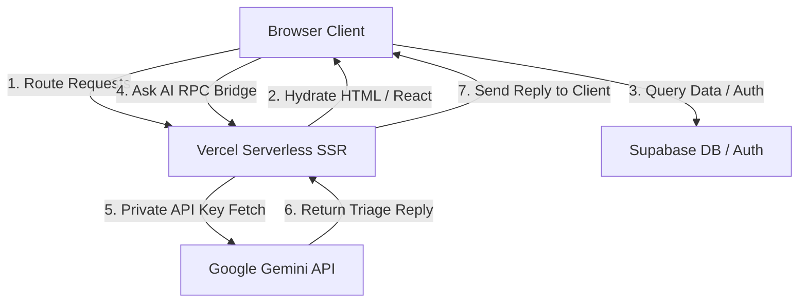

# 🐾 PawPal AI — Pet Health & Constellation Triage Assistant

**Reference ID**: [Your Reference ID Here]

PawPal AI is a premium, high-fidelity web application designed to help pet owners track their pet's health, manage medical records, monitor vaccinations, and consult a vet-backed AI assistant in real-time. 

---

## 🌟 Hackathon Scoring Focus

### 1. Theme Relevance & Innovation (35% Total)
* **The Concept**: Pet parents often panic when a symptom arises, resort to stressful Google searches, and forget vaccination schedules. PawPal AI acts as a "vet in your pocket," providing immediate triage advice and organizing medical timelines.
* **Innovative UI**: Instead of standard dashboard layouts, the landing page features a **3D volumetric stardust canvas** where particles morph in real-time to match the topic of the current panel (Cat ➔ Dog ➔ GirlCat ➔ Exploding Star) as the user scrolls, creating a beautiful cosmic visual theme.

### 2. Technical Execution & Architecture (25%)
* **Framework**: Built on **TanStack Start** with **React 19** and **Vite** for fast Server-Side Rendering (SSR) and client hydration.
* **Database & Auth**: Backed by **Supabase** for secure user sessions and real-time database updates.
* **3D Graphics**: Powered by **Three.js** with ACES Filmic Tone Mapping and custom Vertex/Fragment shaders for custom-colored stardust physics.
* **State & Easing**: Custom horizontal scroll easement loops using requestAnimationFrame to capture touch, mousewheel, and swipe events seamlessly.

### 3. Security (15%)
* **Zero Client-Side API Key Exposure**: Reflecting strict security standards, the application delegates Google Gemini AI generation requests to a secure **TanStack Start Server Action** (`src/utils/chat.ts`). The Gemini API Key is executed privately on Vercel's serverless environment, preventing keys from leaking to client-side bundles or browser console request headers.
* **Row-Level Security (RLS)**: Database tables are secured via Supabase RLS policies. Users can only access, modify, or delete pet records and chat message histories belonging to their authenticated `user_id`.
* **Build Integrity**: Strict git rules ignore `.env` configuration files and `.vercel` local builder outputs.

### 4. UX / UI & Polish (15%)
* **Visual Theme**: A pure black cosmos (`#000000`) styled with rich neon violet glows, glassmorphic panels (`backdropFilter`), and Outfit / Space Grotesk typography.
* **Micro-Interactions**: Hoverable element spring scales, interactive magnetic buttons, dynamic border shadows on dashboard timeline items matching their categories (checkups, vaccinations, illnesses), and onboarding checklists.
* **Developer Modal**: Includes a glassmorphic floating developer details modal triggered from a neon-pulsing "About" header button.

---

## 🏗️ Architecture Overview



---

## 🛠️ Local Development Setup

### Prerequisites
* [Node.js](https://nodejs.org/) (v18+) or [Bun](https://bun.sh/)
* A Supabase project instance

### 1. Clone the repository
```bash
git clone https://github.com/imnotparama/PawPal.git
cd PawPal
```

### 2. Configure Environment Variables
Create a `.env` file in the root directory and configure the following keys:
```env
VITE_SUPABASE_URL=your_supabase_url
VITE_SUPABASE_ANON_KEY=your_supabase_anon_key
VITE_GEMINI_API_KEY=your_gemini_api_key
```

### 3. Install Dependencies
```bash
npm install
# or
bun install
```

### 4. Start the Dev Server
```bash
npm run dev
# or
bun dev
```
Open [http://localhost:8080](http://localhost:8080) to view the application.

---

## 🚀 Vercel Deployment Instructions

To deploy the TanStack Start SSR application to Vercel:
1. Push your latest code changes to GitHub.
2. Import the repository into your **Vercel Dashboard**.
3. In **Build Settings**, set the Build Command to:
   ```bash
   NITRO_PRESET=vercel npm run build
   ```
4. Add your environment variables (`VITE_SUPABASE_URL`, `VITE_SUPABASE_ANON_KEY`, `VITE_GEMINI_API_KEY`).
5. Click **Deploy**. Vercel will build the static client and serverless SSR routes automatically.
