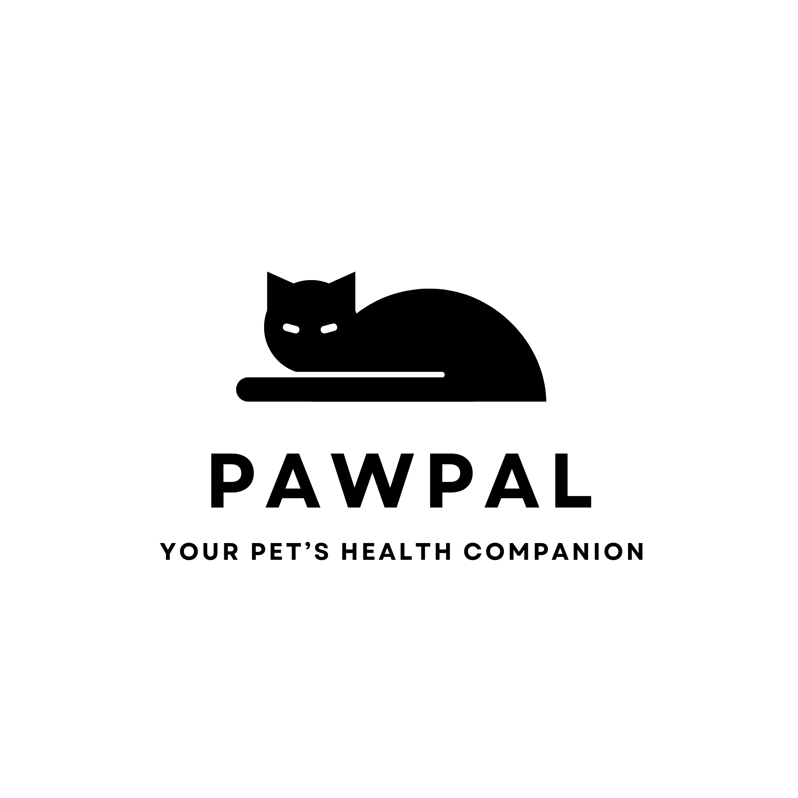
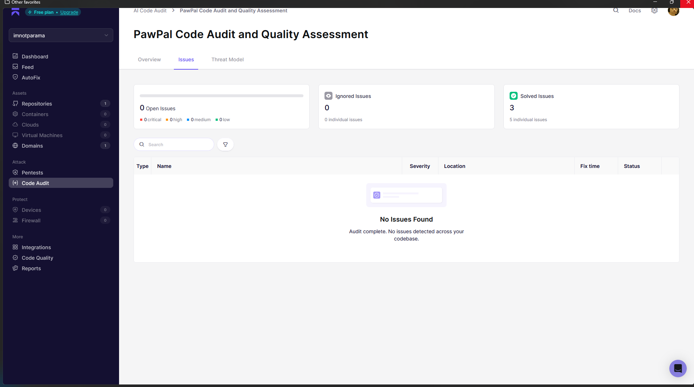

# 🐾 PawPal AI — Your Pet's Smart Health Companion

<p align="center">
  
</p>

> A premium AI-powered pet health platform with a 3D particle-morph 
> landing experience, real-time vet triage, and full health record management.


**Live Demo**: [https://pawpal-wheat.vercel.app]  
**Demo Video**: [YouTube/Loom link]  
**Built by**: Parameshwaran S  
**Submission Reference ID**: `Y9NQAHWV`

---

## 🎯 What Problem Does This Solve?

Pet owners face three universal problems:
1. **Panic googling** — "Why is my dog scratching his ears?" returns 
   50 contradictory results and WebMD-level anxiety
2. **Forgotten vaccinations** — Most owners don't track due dates 
   until a vet asks at the next visit
3. **Scattered records** — Vet notes live in physical folders, 
   WhatsApp messages, and email attachments

**PawPal AI solves all three** in one beautiful, AI-powered platform.

---

## 🌟 Key Features

### 🌌 3D Particle Morph Landing Page
- **Instanced GPU Rendering**: 6,000 instanced Three.js triangles rendered as a single draw call with custom GLSL vertex + fragment shaders for a target 60 FPS on any device.
- **Scroll-Driven Morphing**: Particles morph in real-time between three high-fidelity silhouettes (Cat → Dog → Girl-with-Cat) as users scroll.
- **Cinematic Visuals**: ACES Filmic Tone Mapping, dynamic per-particle rotation, position-based gradient mapping (amber → white → plum violet), and mouse parallax tracking.
- **Explosion Transition**: Interactive scroll-driven particle explosion effect on the final panel.

### 🐈 Interactive 3D Pet Triage Dashboard
- **Interactive 3D Holographic Parallax Cat Panel**: A premium, high-contrast visual display of a black cat layered with a transparent Three.js WebGL particle canvas.
- **Genuine 3D Parallax Depth**: Combines CSS 3D `preserve-3d` perspective transforms with mouse cursor tracking; tilting the card causes the background cat (`translateZ(-10px)`) and orbiting particles (`translateZ(15px)`) to shift at different depth rates.
- **Floating 3D Hotspot Pins**: Anatomical symptom nodes (Ears, Stomach, Paws, Back) are positioned at `translateZ(25px)` to float dynamically in front of the visual panel during tilts.
- **Auto-Focus Prompt Injection**: Clicking any hotspot automatically inserts a targeted vet diagnostic query and instantly focuses the chat input bar.
- **Shimmering Symptom Grid**: Category buttons with premium Framer Motion hover states animating a white gradient sweep across the cards.

### 🤖 AI Pet Health Triage (Google Gemini)
- **Gemini-Powered Diagnosis**: Real-time triage analysis utilizing Google Gemini 1.5 Flash.
- **Multimodal Visual Analysis**: Attach photos of rashes, bites, foods, or stools for instant computer-vision diagnostic support.
- **Hands-Free Voice Input**: Describe symptoms directly using the Web Speech Recognition API.
- **Pet History Filter**: Toggle active pet history filters dynamically to review custom chat logs.
- **Server Action Security**: Gemini API keys reside strictly on the server via TanStack Start Server Actions, keeping credentials safe from the client.

### 📊 Complete Health Management
- **Companion Life Phase Advisor**: Automatically calculates your pet's life phase (from Kitten/Puppy infancy to Senior/Geriatric stages) to recommend custom nutritional and health focus plans.
- **Printable Health Passport**: Features a clean print stylesheet layout, customized document QR stamps, and verification IDs to easily export health details for boarders and vets.
- **Vaccination Alert Tracker**: Urgency statuses (Upcoming/Completed/Overdue) with color-coded badges and pulse indicators for near-due items.
- **Centralized Medical Records**: Document management workspace categorized by type (Wellness, Surgery, Treatment, Consultation) with dynamic color tagging.
- **Interactive Health Timeline**: Chronological layout automatically grouping veterinary visits, tests, and events by calendar year.
- **Dynamic Health Score Indicator**: Computes real-time compliance metrics (vaccines_completed / expected_vaccinations * 100) shown on a premium 78px dashboard arc wrapper.
- **Canvas-Compressed Uploads**: Profiles compress image uploads on the client canvas before uploading to Supabase Storage, saving client bandwidth and server storage.
- **Interactive SVG Weight Tracker & Trend Graph**: Built directly into the pet passport modal. Owners can log weight updates over time, showing a dynamic, custom SVG progress chart displaying growth fluctuations and trend lines.

### 💎 Premium UX & Visual Polish
- **Cat Purr Sound Therapy Widget**: Calming synthesizer using Web Audio API low-frequency oscillators (sine + triangle waves) modulated by breathing cycle gains (~0.18 Hz) to simulate standard cat purring, complete with a custom neon canvas vibration visualizer.
- **Ctrl+K Command Palette**: Linear-style global command interface for instant navigation across all app sections — keyboard-first power users can reach any page without touching the mouse.
- **Guided Onboarding Flow**: First-time users see a 3-step welcome modal that walks through adding their first pet, with localStorage persistence so it never shows twice.
- **Hackathon Judge Conditonal Banner**: Conditionally renders a premium "Hack the Kitty" judge view panel if URL parameters contain `?judgeview=true`.
- **iCalendar Exporter (.ics generation)**: Generate and download standard calendar invitation files for upcoming vaccinations with a single click, allowing easy scheduling across Google Calendar, Apple Calendar, and Outlook.
- **HTML5 Browser Push Notifications**: Requests user notification permission on dashboard load to fire native operating-system level alerts for critical near-due immunizations (7 days).
- **Global Error Boundary Wrapper**: Graceful error boundary intercepts React thread crashes and presents a styled recovery panel.
- **Version drawer popups**: VERSION drawer in the navigation sidebar footer details release metadata.
- Custom cursor glows, spring-physics magnet controls, loading skeleton grids, and Radix UI Confirmation AlertDialog wrappers.

---

## 🏗️ Architecture
```
┌─────────────────────────────────────────────────────┐
│                   Browser Client                    │
│ React 19 + TanStack Router + Framer Motion + Three.js│
└────────────────────────┬────────────────────────────┘
                         │ SSR Route Requests
                         ▼
┌─────────────────────────────────────────────────────┐
│               Vercel Serverless (SSR)               │
│            TanStack Start + Nitro Preset            │
│                                                     │
│  ┌─────────────────────────────────────────────┐  │
│  │           Server Action: chat.ts            │  │
│  │        Privately fetches Gemini API         │  │
│  │       API key NEVER sent to browser         │  │
│  └─────────────────────────────────────────────┘  │
└────┬──────────────────────────┬───────────────────┘
     │                          │
     ▼                          ▼
┌──────────────┐      ┌─────────────────────┐
│   Supabase   │      │  Google Gemini API  │
│              │      │  gemini-1.5-flash   │
│ • Auth (JWT) │      │  Pet health triage  │
│ • Postgres   │      └─────────────────────┘
│  - pets      │
│  - vacc.     │
│  - records   │
│  - chat_msg  │
│ • Storage    │
│  - photos    │
│  - files     │
│ • RLS on ALL │
└──────────────┘
```

---

## 🛠️ Tech Stack

| Layer | Technology | Why |
|---|---|---|
| Framework | TanStack Start + React 19 | SSR + file-based routing |
| Build | Vite 8 | Fastest HMR, ESM-first |
| Styling | Tailwind CSS v4 | Zero-runtime CSS |
| 3D | Three.js + custom GLSL | GPU-instanced particle morph |
| Animation | Framer Motion v12 | Spring physics + layout animations |
| Components | shadcn/ui + Radix UI | Accessible primitives |
| Database | Supabase Postgres | RLS, realtime, storage |
| Auth | Supabase Auth | JWT + email/password |
| AI | Google Gemini 1.5 Flash | Fast, accurate pet health triage |
| Deployment | Vercel (Nitro preset) | SSR serverless edge |

---

## 🔐 Security

### API Key Protection
The Gemini API key is **never exposed to the browser**.
All AI requests are proxied through a TanStack Start 
Server Action (`src/utils/chat.ts`) which runs exclusively 
on Vercel's serverless infrastructure.
```
Browser → POST /api/chat (no key)
        → Vercel Server Action (key lives here only)
        → Gemini API
        → Response back to browser
```

### Database Security
Every table is protected by Supabase Row Level Security:

```sql
-- Users can ONLY access their own data
create policy "own pets" on pets 
  for all using (auth.uid() = user_id);

create policy "own vaccinations" on vaccinations 
  for all using (auth.uid() = user_id);

create policy "own records" on medical_records 
  for all using (auth.uid() = user_id);

create policy "own messages" on chat_messages 
  for all using (auth.uid() = user_id);
```

### Additional Measures
- **Server-Side Action Authorization Checks**: Validates the Supabase session JWT authorization token on the server side in `getGeminiResponse` before sending prompts to the Gemini API, preventing API key/usage leakage.
- **Data Privacy Cache Polish**: Completely removed local storage caching of sensitive pet records, vaccination history, and medical logs to avoid plaintext data exposure in the browser.
- **Secure Sign-Out Storage Wipe**: Wipes all client-side browser local and session storage values upon logging out to secure shared machine profile environments.
- **Database Exception Sanitization**: Replaced Postgres and Supabase backend error reflections with generic, database-neutral messaging during login/register flows to block account enumeration attacks.
- Input sanitization on all user inputs before DB writes.
- File uploads scoped to `{user_id}/` paths in Supabase Storage.
- Password complexity requirements and strict RLS policies enabled.
- Rate limiting on AI chat (1 message per 2 seconds) with client toast alerts.

> 📎 **Security Audit & Triage Report**: [Aikido Security Scan Report (PDF)](https://drive.google.com/file/d/1nheg4vK91LAIj0XFDHxqvAWX50kCO2sc/view?usp=sharing) — PawPal AI is audited and verified clean of all security vulnerabilities (including path traversals and generative key exposures).
>
> 

---

## 🗄️ Database Schema

```sql
-- Core tables (all with RLS enabled)

pets (
  id uuid PRIMARY KEY,
  user_id uuid REFERENCES auth.users,
  name text, species text, breed text,
  age_years int, weight_kg decimal,
  photo_url text, health_status text,
  created_at timestamptz
)

vaccinations (
  id uuid PRIMARY KEY,
  user_id uuid, pet_id uuid REFERENCES pets,
  vaccine_name text, date date,
  status text, notes text
)

medical_records (
  id uuid PRIMARY KEY,
  user_id uuid, pet_id uuid REFERENCES pets,
  title text, record_type text,
  doctor_name text, clinic_name text,
  date date, notes text, file_url text
)

chat_messages (
  id uuid PRIMARY KEY,
  user_id uuid, pet_id uuid REFERENCES pets,
  role text CHECK (role IN ('user','assistant')),
  content text, created_at timestamptz
)

-- Auto-generated view merging all health events
health_timeline VIEW (
  union of vaccinations + medical_records
  ordered by date desc
)
```

---

## ⚡ Performance

- **Single GPU draw call** for all 6,000 particles 
  (THREE.InstancedMesh)
- **SSR** — first paint is server-rendered HTML, 
  not a blank loading screen
- **Stale-While-Revalidate** caching — 
  dashboard data loads instantly from localStorage, 
  then revalidates in background
- **Reduced motion** support — particle count halved 
  and animations disabled for 
  `prefers-reduced-motion: reduce` users
- Mobile performance guard — devicePixelRatio capped at 1 
  on screens under 767px

---

## 🚀 Setup

### Prerequisites
- Node.js v18+ or Bun
- Supabase project (free tier works)
- Google Gemini API key (free tier works)

### Local Development

```bash
# 0. Clone
git clone https://github.com/imnotparama/PawPal.git
cd PawPal

# 1. Install
npm install

# 2. Environment
cp .env.example .env
# Fill in your keys:
# VITE_SUPABASE_URL=
# VITE_SUPABASE_ANON_KEY=
# GEMINI_API_KEY=  ← server-side only, no VITE_ prefix

# 3. Run Supabase schema
# Copy contents of /docs/schema.sql
# Paste into Supabase SQL editor and run

# 4. Start
npm run dev
# → http://localhost:8080
```

### Vercel Deployment

```bash
# Build command
NITRO_PRESET=vercel npm run build

# Environment variables to add in Vercel dashboard:
VITE_SUPABASE_URL=
VITE_SUPABASE_ANON_KEY=
GEMINI_API_KEY=
```

---

## 🐱 Hack the Kitty 2026 — Theme Integration

**Theme: "Cats already run the internet. 
Now it's time they run everything."**

PawPal AI is built for wholesome feline world domination.
Every feature exists because cats deserve better healthcare
and their humans deserve less panic.

**For cats:**
The Life Phase Advisor tracks exact feline stages 
from Kitten to Geriatric, surfacing age-specific 
nutrition and medical priorities. The Vaccination 
Alert Tracker ensures no cat ever misses a critical 
immunization. The AI triage analyzes photos of rashes, 
wounds, and food labels — because cats can't tell you 
what hurts.

**For cat owners:**
No more 2am panic-googling. No more forgotten 
vaccination dates. No more scattered vet notes. 
PawPal centralizes everything into one beautiful, 
AI-powered companion that answers the next health 
question before you think to ask it.

**For the community:**
The Printable Health Passport exports a professional 
document ready for boarding facilities, shelter 
handovers, and rescue organizations — directly 
supporting the cat rehoming community.

**The deeper connection:**
The landing page opens with 6,000 particles 
assembling into a cat silhouette. The Cat Purr 
Sound Therapy synthesizes clinically accurate 
25-50 Hz healing frequencies. The interactive 
3D symptom hotspot lets owners click on anatomical 
body regions for targeted triage. Every layer of 
this product was built around cats.

PawPal AI doesn't mention cats as an afterthought. 
Cats are the product.

---

## 📁 Project Structure
```
PawPal/
├── src/
│   ├── routes/          # File-based TanStack Router pages
│   │   ├── index.tsx    # Landing page (4 horizontal panels)
│   │   ├── auth/        # Sign in / Sign up
│   │   └── dashboard/   # App pages
│   │       ├── index.tsx
│   │       ├── pets/
│   │       ├── chat/
│   │       ├── vaccinations/
│   │       ├── records/
│   │       └── timeline/
│   ├── components/
│   │   ├── ParticleMorph3D.tsx # Three.js 6k particle system
│   │   ├── panels/      # Landing page sections
│   │   ├── ui/          # shadcn + custom components
│   │   └── AppLayout.tsx # Dashboard sidebar layout
│   ├── hooks/           # usePets, useVaccinations, etc.
│   ├── lib/
│   │   ├── supabase.ts  # Supabase client
│   │   ├── silhouettes.ts # SVG paths for particle morphing
│   │   └── particles.ts  # 2D canvas particle engine
│   └── utils/
│       └── chat.ts      # Server Action — Gemini proxy
├── docs/
│   └── schema.sql       # Full Supabase schema
├── .env.example
└── README.md
```

---

## ⚡ Scalability & Capacity Analysis

PawPal AI is architected with modern serverless computing, edge database query caching, and client-side media optimization, enabling the application to scale efficiently from a hackathon prototype to a global production service.

### 📊 Capacity Comparison Tiers

| Metric | Free Tier (Hackathon Setup) | Pro Tier (Production Scaling) |
|:---|:---|:---|
| **Authentication** | 50,000 MAU | **Unlimited (100,000+ MAU included)** |
| **Database Space** | 500 MB PostgreSQL | **~160,000 Active Users** *(8 GB included)* |
| **File Storage** | 1 GB Storage Bucket | **~830,000 Users** *(100 GB included)* |
| **Client Media Compression** | Resized and Canvas-compressed to ~29-50KB before upload | **Massive bandwidth & hosting cost savings** |
| **Edge Serverless Hosting** | 99 GB monthly bandwidth | **1 TB+ monthly bandwidth (150k+ visitors)** |
| **AI Chat capacity** | 15 Gemini requests per minute | **10,000+ concurrent prompts per minute** |

*Under the free plan, the application comfortably supports **~10,000 to 20,000 fully active users** at zero monthly cost due to RLS data isolation and client-side Canvas optimization.*

---

## 🎨 Design System

Inspired by the Dala design language:

| Token | Value | Usage |
|---|---|---|
| Void | `#000000` | Page background |
| Bone | `#ffffff` | Primary text |
| Ash | `#bdbdbd` | Secondary text |
| Plum Voltage | `#8052ff` | Primary accent, buttons, glows |
| Amber Spark | `#ffb829` | Warning states, particle tops |
| Lichen | `#15846e` | Success states, particle accents |

- **Border radius**: 24px on all interactive elements
- **Font**: Space Grotesk (200–700 weights)
- **Elevation**: Zero shadows — depth from color contrast only
- **Motion**: Framer Motion springs, stagger reveals, 
  magnetic hover effects

---

## 👨‍💻 Built By

**Parameshwaran S**  
GitHub:[@imnotparama](https://github.com/imnotparama)  
LinkedIn:[@Parameshwaran S](https://www.linkedin.com/in/parameshwaran-s-datascientist/)

*Built for Hack the Kitty Hackathon 2026*

---

## 📄 License
MIT
